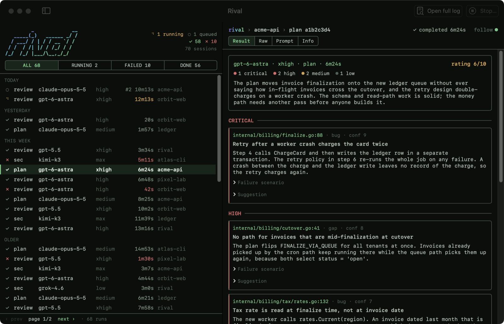
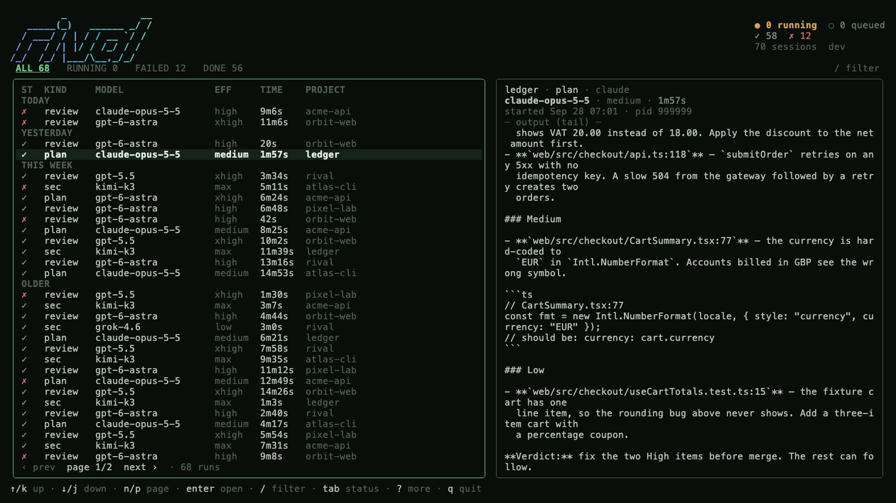

# rival


## TL;DR

Rival sends your code, or your plan, to a different AI model for an independent review, and it runs in the background while you keep working.

**Install on macOS or Linux**

```bash
brew install 1905/tap/rival                 # the CLI (macOS and Linux)
rival install                             # skills for Claude Code (and Codex, when detected)
```

See [macOS](#macos), [Linux](#linux), or [Windows](#windows) for full installation steps. Windows ZIP downloads start with v5.0.0.

The optional macOS viewer installs separately: `brew install --cask 1905/tap/rival-app`. Rival.app is ad-hoc signed, not notarized. If Homebrew asks, run `brew trust --tap 1905/tap`. See [Rival.app](#rivalapp) for the DMG option.

**The five most used skills**

| Skill | What it does |
|---|---|
| `/rival-codex review` | Codex (`gpt-6-astra`, xhigh) hunts bugs in your changed files. |
| `/rival-claude review` | Claude (Opus 5.5, medium) hunts bugs in your changed files. |
| `/rival-security` | Hunts exploitable vulnerabilities across twelve classes. |
| `/rival-plan-codex plan.md` | Codex rates a plan from 1 to 10 and lists its bugs and gaps. |
| `/rival-antislop` | Finds over-engineering and code that should not exist, with a cut list. |

| Rival.app | `rival tui` |
|---|---|
|  |  |

---

## Reference (for agents)

Everything below is checked against the `rival` binary and its source. Commands, flags, defaults and exit codes are exact.

### Contents

1. [Install and setup](#install-and-setup)
2. [Skills](#skills)
3. [Native commands](#native-commands)
4. [Detached flow and `rival wait`](#detached-flow-and-rival-wait)
5. [Models and effort](#models-and-effort)
6. [Code review: JSON contract and console output](#code-review-json-contract-and-console-output)
7. [Plan and antislop: contract and rating](#plan-and-antislop-contract-and-rating)
8. [Security review](#security-review)
9. [GitLab MR review](#gitlab-mr-review)
10. [Configuration](#configuration)
11. [Queue and timeouts](#queue-and-timeouts)
12. [Sessions directory](#sessions-directory)
13. [TUI](#tui)
14. [Rival.app](#rivalapp)
15. [Claude authentication and sandboxing](#claude-authentication-and-sandboxing)
16. [Removed in this release](#removed-in-this-release)
17. [Uninstall](#uninstall)

### Install and setup

Choose your system below. The CLI runs on macOS, Linux and Windows. Rival.app is available only on macOS.

**Release availability:** v5.0.0 and later contain the Rust CLI for macOS, Linux and Windows. v4.2.0 and earlier contain the Go CLI for macOS and Linux only.

#### macOS

With [Homebrew](https://docs.brew.sh/Installation), on Apple Silicon or Intel:

```bash
brew install 1905/tap/rival
rival version
rival install
```

To install without Homebrew:

1. Download the matching archive and `checksums.txt` from the same [release](https://github.com/1905/rival/releases).
2. Open Terminal in the download folder. Select your archive:

| Mac | Archive |
|---|---|
| Apple Silicon (M1 or later) | `rival_darwin_arm64.tar.gz` |
| Intel | `rival_darwin_amd64.tar.gz` |

```bash
archive=rival_darwin_arm64.tar.gz    # use rival_darwin_amd64.tar.gz on Intel
shasum -a 256 "$archive"
```

Compare the hash with the matching line in `checksums.txt`. If it matches, install:

```bash
rival_extract=$(mktemp -d)
tar -xzf "$archive" -C "$rival_extract"
mkdir -p "$HOME/.local/bin"
install -m 755 "$rival_extract/rival" "$HOME/.local/bin/rival"
export PATH="$HOME/.local/bin:$PATH"
rival version
rival install
```

Add `export PATH="$HOME/.local/bin:$PATH"` to `~/.zprofile` to keep the command available in new terminals. If you use Bash, add it to `~/.bash_profile` instead.

#### Linux

With [Homebrew on Linux](https://docs.brew.sh/Homebrew-on-Linux):

```bash
brew install 1905/tap/rival
rival version
rival install
```

To install without Homebrew, download your archive and `checksums.txt` from the same [release](https://github.com/1905/rival/releases). Run `uname -m` to identify your CPU:

| `uname -m` | Archive |
|---|---|
| `x86_64` (Intel or AMD) | `rival_linux_amd64.tar.gz` |
| `aarch64` or `arm64` | `rival_linux_arm64.tar.gz` |

The Rust Linux archives require glibc. They do not target Alpine or other musl-based systems.

In the download folder:

```bash
archive=rival_linux_amd64.tar.gz    # use rival_linux_arm64.tar.gz on ARM64
sha256sum "$archive"
```

Compare the hash with the matching line in `checksums.txt`. If it matches, install:

```bash
rival_extract=$(mktemp -d)
tar -xzf "$archive" -C "$rival_extract"
mkdir -p "$HOME/.local/bin"
install -m 755 "$rival_extract/rival" "$HOME/.local/bin/rival"
export PATH="$HOME/.local/bin:$PATH"
rival version
rival install
```

Add `export PATH="$HOME/.local/bin:$PATH"` to your shell startup file (`~/.bashrc` for Bash, `~/.zshrc` for Zsh).

#### Windows

Download your ZIP and `checksums.txt` from the same [release](https://github.com/1905/rival/releases). In Settings → System → About, check **System type**:

| System type | Archive |
|---|---|
| x64-based processor (Intel or AMD) | `rival_windows_amd64.zip` |
| ARM-based processor | `rival_windows_arm64.zip` |

Open PowerShell in the download folder:

```powershell
$archive = '.\rival_windows_amd64.zip'   # use rival_windows_arm64.zip on ARM64
Get-FileHash $archive -Algorithm SHA256
```

Compare the hash with the matching line in `checksums.txt`. If it matches, extract the files and add the folder to your user PATH:

```powershell
$rivalBin = Join-Path $env:LOCALAPPDATA 'Programs\Rival'
Expand-Archive -LiteralPath $archive -DestinationPath $rivalBin -Force
$userPath = [Environment]::GetEnvironmentVariable('Path', 'User')
if (($userPath -split ';') -notcontains $rivalBin) {
    [Environment]::SetEnvironmentVariable('Path', "$rivalBin;$userPath", 'User')
}
$env:Path = "$rivalBin;$env:Path"
rival version
rival install
```

No administrator account is needed. New terminals inherit the saved PATH. Rival stores its state in `%USERPROFILE%\.rival`.

The binary is not code-signed. SmartScreen or antivirus software can warn on the first run. If Windows blocks the verified download, run `Unblock-File (Join-Path $rivalBin 'rival.exe')` and try again.

#### Build from source

Install [Rust through rustup](https://rust-lang.org/tools/install/) and Git. The repository selects Rust 1.98. Follow rustup's platform instructions for the native linker and C build tools. On Windows, use the MSVC toolchain and Visual Studio's Desktop development with C++ tools. Windows ARM64 also needs the ARM64 C++ build tools and Clang.

These commands work in a Unix shell or PowerShell:

```text
git clone https://github.com/1905/rival.git
cd rival
cargo install --locked --path crates/rival
rival version
rival install
```

Cargo installs to `~/.cargo/bin` on macOS/Linux or `%USERPROFILE%\.cargo\bin` on Windows. If `rival` is not found, open a new terminal or add that directory to PATH.

A plain Cargo build reports version `dev`. On macOS/Linux, `make cli-install` sets the version from `git describe`. `make install` installs the separate Mac app.

#### Updates and skills

For a Homebrew installation, run `rival update`. It checks the latest release, upgrades through Homebrew when needed, and refreshes the skills.

For a manual archive installation, repeat your OS's download, checksum and extraction steps with the new release. Then run `rival install` again. For a source installation, update the checkout and repeat `cargo install --locked --path crates/rival`. Binary upgrades through `rival update` require Homebrew.

Each Rust release archive contains `rival` (`rival.exe` on Windows), `LICENSE`, `README.md` and `licenses/Go-LICENSE`. Keep the license files with redistributed copies.

```bash
rival install                   # Claude Code, plus Codex when detected
rival install --target codex    # explicit Codex install
rival install --target all      # both sets of skills
rival install --force           # overwrite without prompting
```

| Flag | Default | Effect |
|---|---|---|
| `--target` | `auto` | `auto`, `claude`, `codex` or `all`. |
| `--force` | off | Overwrite installed skills without prompting. |

- Claude Code skills go to `~/.claude/skills`. Codex skills go to `~/.agents/skills`. On Windows, `~` means `%USERPROFILE%`.
- `--target auto` always installs for Claude Code. It adds Codex when one of these exists: `codex` on `PATH`, `$CODEX_HOME`, `~/.codex`, or `Codex.app` in `~/Applications` or `/Applications`.
- `rival install` removes retired skills: `rival-review`, `rival-sol`, `rival-plan-sol`, `rival-astra`, `rival-plan-astra`, `rival-fable`, `rival-plan-fable`, `rival-antislop-plan` and older names.

#### Provider runtimes

Install and authenticate the runtime for each model you use. Rival does not include these programs.

| Model | Runtime and authentication |
|---|---|
| Codex (`gpt-6-astra`) | [Codex CLI](https://github.com/openai/codex): `npm install -g @openai/codex && codex login`. |
| Claude (`claude-opus-5-5`) | [Claude Code](https://code.claude.com/docs/en/overview) CLI, authenticated with `claude auth login`. On Windows, use native Claude Code; Docker fallback has a known drive-path defect. On macOS/Linux, if `claude` is not on `PATH`, Rival uses the `rival-claude` Docker image with `RIVAL_CLAUDE_TOKEN` (see [docs/claude-docker-setup.md](docs/claude-docker-setup.md)). |
| Kimi K3 (`moonshotai/kimi-k3`) | [OpenCode](https://opencode.ai/docs) plus `MOONSHOT_API_KEY`, exported or in a gitignored project `.env`. |
| Grok (`grok-4.6`) | [Grok CLI](https://docs.x.ai/) with `grok login`. `XAI_API_KEY` is not supported. |
| Grok via OpenRouter (`x-ai/grok-4.6`) | OpenCode plus `OPENROUTER_API_KEY`. Used only by the security review. |

### Skills

`rival install` installs nine skills. In Claude Code they are slash commands (`/rival-codex`). In Codex they are `$rival-codex` and so on. Every skill launches a detached run (see [Detached flow](#detached-flow-and-rival-wait)).

| Skill | Syntax | Runs | Default model and effort |
|---|---|---|---|
| `/rival-codex` | `[-re low\|medium\|high\|xhigh\|ultra] [review [scope] \| prompt]` | `rival command codex` | Codex, xhigh |
| `/rival-claude` | `[-re level] [scope]` (always a review) | `rival command claude` | Claude, medium |
| `/rival-k3` | `[review [scope] \| prompt]` | `rival command k3` | Kimi K3, max (fixed) |
| `/rival-grok` | `[-re low\|medium\|high] [review [scope] \| prompt]` | `rival command grok` | Grok, high |
| `/rival-security` | `[scope]` | `rival command security` | `security.reviewer` (default `k3`) |
| `/rival-antislop` | `[-m codex,claude] [-re level] [--] [scope]` | `rival command antislop` | Codex high + Claude medium |
| `/rival-plan` | `<plan.md>` | `rival command plan --model codex --effort xhigh` | Codex, xhigh (pinned) |
| `/rival-plan-codex` | `<plan.md>` | `rival command plan --model codex --effort xhigh` | Codex, xhigh (pinned) |
| `/rival-plan-claude` | `[-re level] <plan.md>` | `rival command plan --model claude` | Claude, medium |

- `review` with no scope reviews the changed files found by git. A scope may be a path or plain language, for example `review the auth middleware`.
- Git scope detection: tracked changes against `HEAD` plus untracked files first. If the tree is clean, the files of the last commit. If there are none, the entire project.
- The scope is a focus hint. Reviewers can read the whole repository.
- A `prompt` (any text that does not start with `review`) runs the model on that prompt. Raw prompts run in full-auto mode in the workdir and can edit files.

### Native commands

Top-level commands (`rival --help`):

| Command | Purpose |
|---|---|
| `rival command <x>` | Skill-facing commands. They read raw skill arguments from stdin. |
| `rival run <x>` | Terminal runners with explicit flags. |
| `rival wait` | Blocks until detached runs finish. |
| `rival tui` | Full-screen session monitor. |
| `rival sessions [--active] [--recent N]` | Prints sessions as a text table. |
| `rival queue` / `rival queue clear [--force]` | Shows queue tickets. `clear` removes dead tickets; `--force` removes all. |
| `rival install`, `rival update`, `rival version`, `rival completion` | Setup and maintenance. |

`rival command` subcommands. Each reads its input from stdin.

- If stdin is a terminal or `/dev/null`, every subcommand prints its usage and starts no model.
- Empty piped input prints usage for `codex`, `claude`, `grok`, `k3` and `plan`. For `antislop` and `security`, empty piped input reviews the changed files.

| Subcommand | Flags (defaults) |
|---|---|
| `codex`, `claude`, `grok`, `k3` | `--workdir` (`.`), `--no-queue` |
| `plan` | `--workdir` (`.`), `--no-queue`, `-m/--model` (`codex`; accepts `codex`, `claude`), `--effort` |
| `antislop` | `--workdir` (`.`), `--no-queue`, `-m/--model` (`codex,claude`), `--effort` |
| `security` | `--workdir` (`.`), `--no-queue`, `--which` |

- `--detach` is a flag on `rival command` and applies to every subcommand.
- `plan --help` shows `--effort` with default `high`. That value is not used unless you pass the flag. Without it, Codex runs at xhigh and Claude at medium.
- `plan` input: one path, optionally `-re <level> <path>`. Use `-- <path>` for a path that starts with `-`.
- `antislop` input: `[-m selector[,selector]] [-re level] [--] [scope]`. Pass `-m` either as a flag or in stdin, not both.

`rival run` subcommands: `claude`, `grok`, `k3`. There is no `rival run codex`; use `rival command codex`.

| Flag | Meaning |
|---|---|
| `--prompt-stdin` | Read the prompt from stdin. |
| `--review <scope>` | Review mode. `--review` wins when both are given. |
| `--effort` | `claude`: low, medium, high, xhigh. `grok`: low, medium, high; higher values clamp to high. `k3` has no effort flag. |
| `--workdir` (`.`), `--no-queue` | As above. |

Examples:

```bash
echo 'review src/api/'             | rival command codex --workdir .
echo '-re high review'             | rival command claude --workdir .
echo 'explain the auth flow'       | rival command codex --workdir .
echo 'docs/plan.md'                | rival command plan --workdir .
echo '-m claude src/'              | rival command antislop --workdir .
echo 'explain the auth flow'       | rival run claude --prompt-stdin --workdir .
rival run grok --review src/api/ --workdir .
rival command security --which
```

Exit codes of `rival command` and `rival run`: `0` on success. On a failed run, the model's non-zero exit code, or `1` for a Rival error such as bad input, a failed preflight or an unusable security review.

### Detached flow and `rival wait`

Skills never block the host session. They use this pattern:

```bash
rival command codex --detach --workdir "$PWD" < input.txt > out.txt 2> err.txt
# stderr line: "rival: detached pid=<N>"
rival wait --log err.txt          # run in the background; exit code = outcome
cat out.txt                       # the review
```

- `--detach` re-executes Rival in its own process session (`setsid`) and exits at once. The run survives the teardown of the launching shell.
- The skill writes the input with a file tool, never with `echo` or a heredoc, so no shell expands it.
- In Claude Code the skill arms `rival wait` as a background task and ends its turn. In Codex the skill keeps the turn and polls `rival wait`.
- If the watcher is lost, run `rival wait --log <err file>` again.

`rival wait` has two modes:

- `rival wait --log <stderr-file>`: reads the PID and session IDs from the stderr file and watches the process. It detects a crash. After the summary it prints the `auto-fix:` policy for the skills.
- `rival wait <session-id>...`: polls session JSON only. The session can turn terminal a moment before stdout is flushed, so prefer `--log`.

| Flag | Default |
|---|---|
| `--log` | none |
| `--poll` | `2s` |
| `--timeout` | `1h35m` with default settings: `RIVAL_QUEUE_TIMEOUT` + 2 × `RIVAL_RUN_TIMEOUT` + 5 minutes. |

| `rival wait` exit code | Meaning |
|---|---|
| `0` | All watched sessions completed. |
| `2` | At least one session failed, including a run timeout. |
| `3` | Rival crashed: the process died and left a session unfinished. |
| `4` | `--timeout` elapsed while a run was still active. |
| `64` | Usage error, for example both `--log` and session IDs. |

### Models and effort

| Label | Model id | Runtime | Built-in effort |
|---|---|---|---|
| `codex` | `gpt-6-astra` | Codex CLI | `xhigh` (antislop: `high`) |
| `claude` | `claude-opus-5-5` | Claude Code CLI (native, else Docker) | `medium` |
| `kimi-k3` | `moonshotai/kimi-k3` | OpenCode, Moonshot provider | `max` (only level) |
| `grok` | `grok-4.6` | Grok CLI | `high` |
| `grok-4.6-openrouter` | `x-ai/grok-4.6` | OpenCode, OpenRouter | `xhigh` (security only) |

- The effort ladder is `low`, `medium`, `high`, `xhigh`, `ultra`. `xhigh` and `ultra` are different levels.
- Precedence: explicit `-re`/`--effort`, then `efforts.<label>` in `~/.rival/config.yaml`, then the built-in value.
- Kimi K3 always runs at `max`. Any `-re` value is accepted and ignored.
- Grok accepts `low`, `medium`, `high`. Higher values clamp to `high`, and the session records the clamped value.
- Claude maps `low` and `medium` to the same CLI levels, and `high`, `xhigh` and `ultra` to the Claude CLI level `max`.
- The plan skills `/rival-plan` and `/rival-plan-codex` always pass `--effort xhigh`.

### Code review: JSON contract and console output

Every single-model code review (`codex`, `claude`, `grok`, `k3` in review mode) asks the model for exactly one JSON object:

```json
{
  "summary": "1-3 sentence reviewer summary",
  "findings": [
    {
      "file": "path/to/file",
      "line": 42,
      "severity": "critical|high|medium|low",
      "category": "bug|security|performance|concurrency|architecture|tests|ux",
      "title": "brief title",
      "body": "concrete explanation tied to code",
      "failure_scenario": "input/state that triggers it → the wrong result",
      "suggestion": "concrete fix",
      "confidence": 8
    }
  ]
}
```

- A clean review is `{"summary": "No issues found.", "findings": []}`.
- Every finding must carry a `failure_scenario`: the input or state that triggers it and the wrong result. The prompt tells the model to drop a finding without one.
- Severity rubric: `critical` = data loss, a reachable security hole, or a crash on a normal path. `high` = wrong result or broken flow on a realistic path. `medium` = wrong result on an edge case, or a real hot-path performance problem. `low` = minor defect with a cheap workaround.

Rival formats the JSON for the console:

```
═══ RIVAL REVIEW ═══

Model: codex (gpt-6-astra)
Scope: src/api/

Summary: <summary>

1. [high] <title> — src/api/handler.go:42
   <body>
   Scenario: <failure_scenario>
   Fix: <suggestion>
   (bug, confidence 8)

Low confidence (1):
- [low] <title> — src/api/util.go:10 (confidence 4)

Findings: 1 total — 0 crit, 1 high, 0 med, 0 low
Log: ~/.rival/sessions/<session-id>.log
```

- Findings are sorted by severity, then by confidence (highest first).
- Findings with confidence below 6 go to the short "Low confidence" block. The `Findings:` tally counts only the main list.
- An empty `findings` array prints `No issues found.`.
- If the output does not parse, Rival prints `═══ RIVAL REVIEW — UNPARSED OUTPUT ═══` with a `Problem:` line and the raw output. The run still exits `0`. Treat that block as "no structured review", never as a clean review.

### Plan and antislop: contract and rating

`rival command plan` reviews one markdown plan or spec. `rival command antislop` reviews code for slop and over-engineering and never reports bugs. Both use this JSON shape:

```json
{
  "summary": "1-3 sentence overall assessment",
  "rating": 7,
  "findings": [
    {
      "file": "section or file",
      "line": 0,
      "severity": "critical|high|medium|low",
      "category": "...",
      "title": "one-line description",
      "body": "what is wrong and why it matters",
      "suggestion": "concrete fix, or the concrete cut",
      "confidence": 8
    }
  ]
}
```

| | Plan | Antislop |
|---|---|---|
| `rating` | 1 (unimplementable or dangerously wrong) to 10 (ready to execute) | Leanness: 1 (mostly slop) to 10 (nothing left to cut) |
| `category` | `bug`, `gap`, `ambiguity`, `scope`, `verification` | `reuse`, `simplify`, `efficiency`, `altitude`, `compat`, `reinvention`, `slop`, `yagni` |
| Console title | `═══ RIVAL PLAN REVIEW ═══` then `File: <path>` | `═══ RIVAL ANTISLOP REVIEW ═══` then `Scope: <scope>` |
| Rating line | `Rating: 7/10` | `Leanness: 7/10` |
| No findings | `No bugs or gaps found.` | `No slop found.` |

- A payload with a `rating` outside 1–10 is rejected as not a real answer.
- Findings print in the same numbered layout as code review, without the `Scenario:` line, followed by the `Findings:` tally.
- With two models, the title names both (`═══ RIVAL PLAN REVIEW (codex + claude) ═══`). Each model gets a `── <label> ──` block.
- A model that cannot run is listed as `Skipped: <label> — <reason>`. It does not fail the run.
- Antislop runs Codex and Claude by default. `-m codex` or `-m claude` runs one model.

### Security review

`/rival-security [scope]` runs `rival command security`. It hunts exploitable vulnerabilities in twelve classes: injection, authorization (including IDOR), authentication, crypto, path traversal, SSRF, deserialization, secret exposure, input validation, CSRF, open redirect, and resource exhaustion. It does not report style or ordinary logic bugs.

The model comes from `security.reviewer` in `~/.rival/config.yaml`:

| Value | Model | Provider | Key | Reasoning |
|---|---|---|---|---|
| `k3` (default) | `moonshotai/kimi-k3` | OpenCode, Moonshot | `MOONSHOT_API_KEY` | `max` |
| `grok` | `x-ai/grok-4.6` | OpenCode, OpenRouter | `OPENROUTER_API_KEY` | `xhigh` |

- `rival command security --which` prints the resolved model, the config value, the key status and `Ready.` or `Not usable.`. It exits `1` when not usable.
- The key is read from the environment first, then from the nearest `.env` walking up from the workdir.
- If the key is missing, the run fails. It never falls back to another model.
- It uses the code-review JSON contract. The console title is `═══ RIVAL SECURITY REVIEW ═══`; an empty list prints `No vulnerabilities found.`.
- Every finding must have a file, a title and a known severity. Otherwise Rival prints `RIVAL SECURITY REVIEW — UNUSABLE OUTPUT` and exits `1`.
- An invalid `security.reviewer` value fails every command at startup.

### GitLab MR review

A single-model review accepts a GitLab merge request URL as its whole scope:

```bash
/rival-codex review https://gitlab.example.com/group/project/-/merge_requests/123
echo 'review https://gitlab.example.com/group/project/-/merge_requests/123' | rival command codex --workdir .
rival run claude --review https://gitlab.example.com/group/project/-/merge_requests/123 --workdir .
```

- Supported by `rival command codex|claude|grok|k3` in review mode and by `rival run <x> --review`.
- Rejected before any reviewer starts by raw prompts, `antislop` and `security`.
- The scope must be one HTTPS URL of the form `.../<namespace>/<project>/-/merge_requests/<N>`, optionally ending in `/diffs` or `/commits`.
- The workdir must be a git repository with a remote for the same host and project.
- Rival resolves the MR with `glab api` (authenticate with `glab auth login --hostname <host>`). It then fetches the exact base and head commits into a temporary checkout. Your checkout and index are not touched.
- The reviewer also receives the full patch. A patch over 512 KiB is refused.
- Output starts with `GitLab MR: <url>`, `Base: <sha>`, `Head: <sha>`.

### Configuration

`~/.rival/config.yaml` is optional. These are all the keys that exist:

```yaml
efforts:              # per-model default effort
  codex: xhigh        # low | medium | high | xhigh | ultra
  claude: medium      # low | medium | high | xhigh | ultra
  grok: high          # low | medium | high | xhigh | ultra (clamped to high)
  kimi-k3: max        # max only

security:
  reviewer: k3        # k3 (default) | grok

claude:
  subscription: team  # free text shown in the TUI Account field, e.g. team or personal

auto_fix_critical_high: false  # true: skills fix CONFIRMED critical/high findings without asking
ste_rewrite: false             # true: one more provider call rewrites findings that use words from the STE not-approved list

roles:                # optional prompt overrides
  bug_hunter: "..."   # replaces the code-review instructions
  security: "..."     # replaces the security-review instructions
```

- The values shown for `efforts` are the built-in defaults.
- An unknown `efforts` key, an invalid effort, or an invalid `security.reviewer` stops every command before it creates a session.
- An old `efforts.sol` key is ignored.
- `auto_fix_critical_high` is off by default. Skills always verify every finding. When it is on, they fix CONFIRMED critical and high findings without asking, then build and test. Medium and low findings are only verified, presented and proposed. `rival wait --log` prints the setting as its last line: `auto-fix: off` or `auto-fix: critical+high`.
- `ste_rewrite` is off by default. When it is on and a review has 3 or more flagged words, rival calls the same provider once more with the review JSON and the flagged words. It keeps the rewrite only if the findings, files, lines, severities, categories and confidences are unchanged, text lengths stay within half to double, and the flagged-word count drops. Otherwise the original review stands. The rewrite output stays in the session log. The word list is `crates/rival-core/data/ste.json`.
- A `roles` override replaces the role instructions only. Rival still appends the JSON contract. An empty override is ignored.

Environment variables:

| Variable | Default | Effect |
|---|---|---|
| `RIVAL_MAX_CONCURRENT` | `2` | Runs allowed at once. |
| `RIVAL_QUEUE_TIMEOUT` | `30m` | Longest wait for a queue slot. |
| `RIVAL_RUN_TIMEOUT` | `30m` | Longest run after it gets a slot. `0` disables it. |
| `RIVAL_NO_QUEUE` | unset | Bypass the queue (same as `--no-queue`). |
| `RIVAL_CLAUDE_AUTH` | `subscription` | `subscription`/`sub` or `api`. See [Claude authentication](#claude-authentication-and-sandboxing). |
| `RIVAL_CLAUDE_TOKEN` | unset | OAuth token for the Docker Claude runtime. |
| `RIVAL_NO_UPDATE_CHECK` | unset | Disable the update check (`CI` also disables it). |
| `RIVAL_NO_TELEMETRY` | unset | Disable telemetry (`DO_NOT_TRACK` and `CI` also disable it). |
| `RIVAL_HOME` | unset | State directory used instead of `~/.rival`: `config.yaml`, `sessions/`, `queue/` and the update-check cache. Set it in the process environment; repository `.env` files cannot set it. Skills still go to `~/.claude/skills` and `~/.agents/skills`. |

### Queue and timeouts

- Rival has no daemon. A cross-process FIFO queue in `~/.rival/queue/` (ticket files plus `flock`) limits concurrent runs to `RIVAL_MAX_CONCURRENT`.
- A waiting run shows as `queued` in the TUI and the app. A dead slot holder is reaped.
- A queue wait longer than `RIVAL_QUEUE_TIMEOUT`, or a run longer than `RIVAL_RUN_TIMEOUT`, fails the session. `rival wait` then exits `2`.
- Use `--no-queue` or `RIVAL_NO_QUEUE` on NFS home directories, where `flock` is not reliable.

### Sessions directory

Every run writes to `~/.rival/sessions/` (`$RIVAL_HOME/sessions/` when `RIVAL_HOME` is set):

- `<session-id>.json`: the session record. It is written to `<session-id>.json.tmp` first and then renamed.
- `<session-id>.log`: the full model output.

Main JSON fields: `id`, `group_id` (shared by the models of one plan or antislop run), `cli`, `mode`, `model`, `effort`, `review_scope`, `prompt_preview`, `status` (`queued`, `running`, `completed`, `failed`), `start_time`, `end_time`, `exit_code`, `duration`, `work_dir`, `log_file`, `error`, `pid`, `pid_start`.

`rival sessions` prints them as a table. The TUI and Rival.app read the same directory.

### TUI

`rival tui` shows runs grouped by day (TODAY, YESTERDAY, THIS WEEK, OLDER), 50 runs per page. Runs with the same `group_id` show as one row.

List keys:

| Key | Action |
|---|---|
| `↑`/`k`, `↓`/`j` | Move up and down. |
| `g`/`Home`, `G`/`End` | First and last run. |
| `n`/`PgDn`, `p`/`PgUp` | Next and previous page. |
| `Enter` | Open the run. |
| `/` | Filter. Space-separated terms, all must match, case-insensitive. `Enter` keeps the filter, `Esc` clears it. |
| `Tab`, `Shift+Tab` | Cycle the status tabs: ALL, RUNNING, FAILED, DONE. |
| `?` | More help. |
| `q`, `Ctrl+C` | Quit. |

Detail keys:

| Key | Action |
|---|---|
| `1`, `2`, `3`, `4` | Result, Raw, Prompt, Info tabs. |
| `j`/`k`, `Enter`/`Space` on Result | Select a finding, then expand or collapse it. |
| `[`, `]` | Previous and next member of a group. |
| `f` | Follow the live output. |
| `/`, `n`, `N` | Search the output, next match, previous match. |
| `o` | Open the log file. |
| `x` | Open the stop confirmation. `y` stops the run; `n` or `Esc` cancels. Unix sends SIGTERM. Windows terminates the owner and its provider tree. |
| `Esc` | Back to the list. |

Finished runs open on Result. Live runs open on Raw. Result shows findings by severity or formatted Markdown. If parsing fails, it offers the raw log.

### Rival.app

A native macOS viewer for the sessions directory. It needs macOS 14 (Sonoma) or later.

```bash
brew install --cask 1905/tap/rival-app
```

Without Homebrew, download `Rival-X.Y.Z.dmg` from the [latest release](https://github.com/1905/rival/releases/latest), open it and drag Rival to Applications. The app is not notarized, so macOS blocks the first launch. To allow it, open System Settings → Privacy & Security and click **Open Anyway** next to the Rival message. This is needed only once. The Homebrew cask does not need this step.

- **Menu bar:** the icon shows the number of live runs. The popover lists up to 10 live runs (then `+N more — open Rival`), the last 5 finished runs, a "Notify on finish" checkbox, Open Rival and Quit.
- **Window:** the run list on the left, with ALL, RUNNING, FAILED and DONE tabs, a filter field (same rules as the TUI filter) and day sections. The selected run shows on the right, with Result, Raw, Prompt and Info tabs and a member picker for groups. Result shows the model's answer as finding cards grouped by severity, or as formatted text. Raw shows the log. Finished runs open on Result and live runs on Raw. If the answer cannot be parsed, Result says why and links to Raw.
- **Pagination:** 50 runs per page. The footer shows `‹ prev  page P/N  next ›`. Keys: `←`/`→` or `[`/`]` turn the page, `↑`/`↓` move, `Home`/`End` jump. `⌘F`, `⌘G` and `⇧⌘G` search the log.
- **Stop:** the Stop… toolbar button opens a confirmation sheet. A live process gets SIGTERM only while its PID start time still matches the run.
- **Notifications:** a notification is posted when a run goes from running or queued to completed or failed. Click it to open the run. Permission is requested on the first finish.
- **Updates:** the app watches the sessions directory and polls as a fallback, so the list updates without a reload.
- `RIVAL_HOME`: the app reads `$RIVAL_HOME/sessions` instead of `~/.rival/sessions` when this is set. The CLI uses the same variable (see [Configuration](#configuration)). The app sees it only when it is in the app's own environment.

From a clone of this repository:

| Command | Effect |
|---|---|
| `make run` | Debug build, bundled as "Rival (dev)", opened against your real `~/.rival`. |
| `make install` | Fresh native release build, installed to `/Applications/Rival.app`. The old copy moves to `/tmp/trash`. |
| `make test` | `swift test` for the app. |

### Claude authentication and sandboxing

Claude runs through the Claude Code CLI and bills your subscription login by default.

| `RIVAL_CLAUDE_AUTH` | Behavior |
|---|---|
| unset, `subscription`, `sub` | Use the CLI login. `ANTHROPIC_API_KEY` and `ANTHROPIC_AUTH_TOKEN` are removed from the child environment. |
| `api` | Bill the API key. `ANTHROPIC_API_KEY` must be set, or the run fails. |
| any other value | Error. |

- Claude code, plan and antislop reviews can use only the Read, Glob and Grep tools. Shell, edits, MCP tools, hooks and plugins are disabled. The Docker transport also mounts the repository read-only.
- These are CLI tool restrictions, not an operating-system sandbox.
- Grok review mode passes `--sandbox read-only`. The Grok CLI profiles fail open when the host has no kernel sandbox, so treat that as a request, not a guarantee.
- Rival removes known credential variables from child processes, and blocks the `GROK_` and `XAI_` prefixes.

### Removed in this release

| Removed | Replacement |
|---|---|
| Megareview: `rival review`, `rival command megareview`, and the consilium judge | `rival command codex review` (skill: `/rival-codex review`) |
| `/rival-review` skill | `/rival-codex review`. `rival install` removes the old skill. |
| Sol (`gpt-5.6-sol`): `rival command sol`, `rival run sol`, `-m sol`, `/rival-sol`, `/rival-plan-sol` | Codex: `rival command codex`, `-m codex`, `/rival-codex`, `/rival-plan-codex` |
| `rival server` (web dashboard) | Rival.app (`brew install --cask 1905/tap/rival-app`) or `rival tui` |

Sessions written by older releases still render in the TUI and the app, with their old labels.

### Uninstall

```bash
brew uninstall --cask rival-app
brew uninstall rival
```

Then delete the `rival-*` directories in `~/.claude/skills` and `~/.agents/skills`. Session history stays in `~/.rival` until you delete it.

## License

MIT
